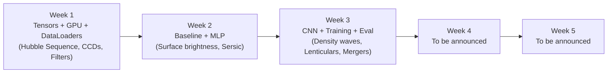
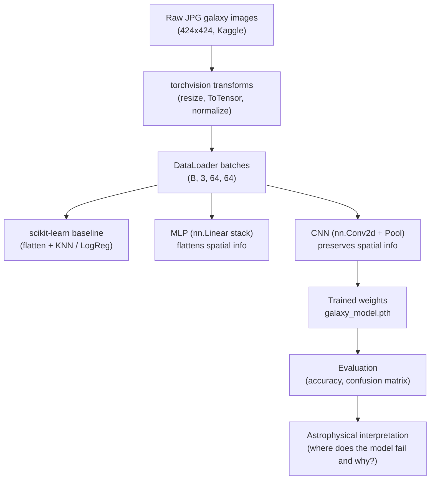

# ML in Astronomy — CSoT'26 Track

> Building a Convolutional Neural Network in PyTorch to morphologically classify galaxies, end-to-end, on Google Colab.

---

## Table of Contents

- [Why ML in Astronomy?](#why-ml-in-astronomy)
- [Project Abstract: Galaxy Classification](#project-abstract-galaxy-classification)
- [Goal, Environment, and Tech Stack](#goal-environment-and-tech-stack)
- [Dataset](#dataset)
- [The Classification Problem We Will Solve](#the-classification-problem-we-will-solve)
- [Learning Arc](#learning-arc)
- [Weekly Modules](#weekly-modules)
- [Skills You Will Build](#skills-you-will-build)
- [Prerequisites](#prerequisites)
- [How to Follow This Track](#how-to-follow-this-track)
- [Glossary](#glossary)
- [Common Pitfalls](#common-pitfalls)
- [FAQ](#faq)
- [What This Track Is *Not*](#what-this-track-is-not)
- [Further Reading and Citations](#further-reading-and-citations)
- [Mentorship](#mentorship)

---

## Why ML in Astronomy?

Astronomy has, almost overnight, become a **data-rich** science. A single night on a modern wide-field survey telescope produces more imagery than the entire Hubble Space Telescope archive accumulated in its first decade. The upcoming **Vera C. Rubin Observatory** (LSST) is expected to detect roughly **20 billion** galaxies over its 10-year survey — far more than any team of humans could ever inspect by eye.

This data deluge is *both* a gift and a problem:

- **Gift** — we can finally test cosmological models on enormous, statistically-meaningful samples.
- **Problem** — every traditional analysis pipeline that assumed a human in the loop falls apart at this scale.

Machine learning, and particularly **deep learning on images**, has emerged as the dominant tool for scaling analysis. Astronomers now routinely use neural networks to:

- Classify galaxy morphologies (this project).
- Detect transient events (supernovae, asteroids, optical counterparts to gravitational waves).
- Estimate **photometric redshifts** from broadband colours.
- Find rare objects (gravitational lenses, brown dwarfs).
- De-blend overlapping sources in crowded images.

This track gives you a working understanding of the **simplest end** of that toolkit — a CNN classifying galaxies — and the vocabulary to read papers that do far more sophisticated things.

---

## Project Abstract: Galaxy Classification

Modern astronomical surveys capture millions of celestial objects, creating overwhelming datasets that far exceed the capacity for manual human analysis. The **morphological classification of galaxies** — sorting them into structural categories such as **spirals, ellipticals, and irregulars** based on the **Hubble Sequence** — is a crucial first step for astrophysicists to understand galaxy evolution, star formation histories, and the broader dynamics of the universe. Historically, this required thousands of volunteer hours through citizen science initiatives like **Galaxy Zoo**.

This project addresses the modern classification bottleneck by developing an automated machine learning pipeline. Using **PyTorch** inside a **Google Colab** environment, we will design and train a **Convolutional Neural Network (CNN)** to autonomously categorise galaxy images.

Unlike traditional algorithmic approaches that flatten images and lose crucial spatial context, the CNN architecture is specifically suited to detect localized physical phenomena such as spiral density waves, surface brightness profiles, and stellar dust lanes. The project workflow encompasses:

- **Data ingestion** via PyTorch `Dataset` and `DataLoader` abstractions, with proper transforms and train/val/test splits.
- **Traditional ML baselines** with scikit-learn — flatten-and-classify approaches that give us a yardstick to beat.
- **Custom deep learning models** built from `nn.Module`, starting with a fully-connected network and graduating to a convolutional one.
- **A full training loop** including loss, optimiser, gradient updates, and evaluation.
- **Rigorous evaluation** using confusion matrices and per-class accuracy to understand where the AI struggles with morphological ambiguities (e.g., Lenticular or merging galaxies).
- **Model persistence** so trained weights can be saved, reloaded, and shared.

Ultimately, this track bridges observational astrophysics and modern computer vision, demonstrating how artificial intelligence can reliably scale the analysis of the cosmos.

---

## Goal, Environment, and Tech Stack

### Goal

Build a CNN that, given a 64×64 (or similar) RGB image of a galaxy from the Galaxy Zoo 2 dataset, predicts a morphological class label (elliptical / spiral / irregular / etc.) with accuracy meaningfully above a flatten-and-classify baseline.

### Environment

**Google Colab with the GPU runtime enabled.** The free **NVIDIA T4** tier is more than sufficient for this project. You will not need to install anything locally:

- Pre-installed: Python 3, PyTorch, torchvision, scikit-learn, matplotlib, NumPy, pandas.
- Pre-mounted: Google Drive (after one click).
- Pre-cached: most popular pre-trained model weights (we'll use a few for transfer learning experiments).

If you have a local GPU and prefer it, everything will run there too, but the track and mentorship are tuned to Colab.

### Tech Stack

| Library         | Version (approx.) | Used for                                                |
|-----------------|-------------------|---------------------------------------------------------|
| Python          | 3.10+             | Everything.                                             |
| PyTorch (`torch`) | 2.x              | Tensors, autograd, training loop, GPU acceleration.     |
| `torchvision`   | matches `torch`   | `ImageFolder` dataset, image transforms, model zoo.     |
| `scikit-learn`  | 1.x               | Baseline classifiers (KNN, Logistic Regression), metrics, confusion matrices. |
| `matplotlib`    | 3.x               | Visualisation of images, batches, losses, confusion matrices. |
| `numpy`         | 1.x               | Numerical interop with sklearn and matplotlib.          |
| `pandas`        | 2.x               | (Optional) wrangling the Galaxy Zoo CSV label files.    |

You will not need to install anything locally — Colab ships every dependency above.

### Hardware Expectations

| Resource | Budget | Why |
|----------|--------|-----|
| GPU memory | ~15 GB (T4) | Comfortable for batch sizes 32–128 at 64×64 resolution. |
| Disk | ~5–10 GB | The full Galaxy Zoo 2 image set unpacked; we may downsample. |
| Time per training run | 5–30 minutes | A small CNN for 5–10 epochs over a curated subset. |
| Total project time | ~25–40 hours over 5 weeks | Concept reading + notebook work + experimentation. |

---

## Dataset

### What we use

We use the **Galaxy Zoo 2** image set, curated by the Galaxy Zoo citizen-science project from imagery taken by the **Sloan Digital Sky Survey (SDSS)**.

- **Kaggle mirror:** [Galaxy Zoo 2 Images](https://www.kaggle.com/datasets/jaimetrickz/galaxy-zoo-2-images) — convenient pre-packaged JPG cutouts plus a filename-mapping CSV (images are **not** sorted into class folders; labels come from the official GZ2 catalogues).
- **Original catalogue paper:** [Willett et al., 2013, *Galaxy Zoo 2: detailed morphological classifications for 304,122 galaxies from the Sloan Digital Sky Survey*](https://academic.oup.com/mnras/article/435/4/2835/1023755).
- **Provenance:** Galaxy Zoo 2 took ~300,000 SDSS galaxies and asked volunteers a **decision tree of questions** ("Is it smooth?", "Does it have a bar?", "How many spiral arms?"). Each galaxy received many independent votes; the published catalogue collapses these into morphology probabilities.

### Why this dataset

- **Clean labels** — every image has been classified by dozens of independent humans, so the labels are noisy in a *known* way (which we can leverage).
- **Right size** — large enough to train a real CNN; small enough to fit on Colab.
- **Real physics** — these are *actual* galaxies in our universe, not a synthetic toy. Mistakes the model makes will often mirror mistakes humans make for the same astrophysical reasons.
- **Well-studied** — there's a body of published ML work on Galaxy Zoo data (including the famous [Kaggle Galaxy Zoo Challenge](https://www.kaggle.com/c/galaxy-zoo-the-galaxy-challenge)) you can read after the track.

### What an image looks like

A single galaxy image from the Kaggle mirror is a **colour JPG**, typically 424×424 pixels, composed from SDSS images in the `g`, `r`, and `i` photometric bands (these are filters in the visible-to-near-infrared range). For training we will downsample to 64×64 to keep things fast on Colab.

The "true colour" you see in the JPG is therefore a *false-colour composite*: each pixel's RGB triple is a stretched mapping of three monochrome filter measurements. Detailed in **Week 1, Part 2**.

### How we'll use it

Detailed download and pipeline instructions show up in **Week 1, Part 2**, when we wire up `Dataset`s and `DataLoader`s. Briefly, the flow will be:

1. Download the Kaggle dataset to Colab (or your Drive) via the Kaggle API, plus the Hart et al. (2016) label CSV from [data.galaxyzoo.org](https://data.galaxyzoo.org/).
2. Join the mapping CSV to the morphology catalogue and build an `ImageFolder`-ready layout (symlink a balanced subset into `galaxy_data/<class>/`).
3. Wrap it in `torchvision.datasets.ImageFolder` with a `transforms` pipeline.
4. Wrap that in a `DataLoader` for shuffled, batched iteration.
5. Train / validate / test with a sensible split (we'll standardise on 70/15/15).

---

## The Classification Problem We Will Solve

To keep the problem tractable and the deliverable interpretable, we collapse the very detailed Galaxy Zoo 2 vote tree into a **small set of high-level morphological classes**. The exact label set will be confirmed in Week 1, Part 2 once we inspect the dataset, but the working plan is:

| Label | Hubble correspondence | Visual hallmark |
|-------|-----------------------|-----------------|
| `elliptical`         | E0–E7         | Smooth featureless oval; no disk, no arms. |
| `spiral_unbarred`    | Sa, Sb, Sc    | Disk with arms, no straight bar through the centre. |
| `spiral_barred`      | SBa, SBb, SBc | Disk with arms *and* a straight bar across the bulge. |
| `lenticular` (`S0`)  | S0            | Disk + bulge but **no arms**. (Optional — sometimes merged into ellipticals.) |
| `irregular_or_merger`| Irr           | Chaotic / disturbed / tidally interacting. |

We may merge `spiral_barred` and `spiral_unbarred` into a single `spiral` class for the first end-to-end run, then split them again in Week 3 to see if the CNN can recover the bar feature on its own. That experiment will be a useful demonstration of how class granularity changes both difficulty and interpretability.

The classes themselves are explained in detail in [`Week-1/04-hubble-tuning-fork.md`](Week-1/04-hubble-tuning-fork.md) and [`Week-1/05-galaxy-morphologies.md`](Week-1/05-galaxy-morphologies.md).

---

## Learning Arc

Each week pairs **machine-learning skills** with the **astronomy concepts** that motivate them. By the end of Week 3 you will have a trained CNN, a confusion matrix you can interpret astrophysically, and saved weights you can re-load. Weeks 4 and 5 build further — content to be announced.

A complementary view — **what flows through the pipeline each week**:

By the end you will be able to explain, defend, and reproduce every arrow in that diagram.

---

## Weekly Modules

| Week | Title | ML Focus | Astronomy Focus | Link |
|------|-------|----------|-----------------|------|
| 1 | Foundations: Tensors, GPUs & the Galaxy Data Pipeline | Tensors, GPU, Colab, `transforms`, `ImageFolder`, `DataLoader` | Hubble Tuning Fork, galaxy morphologies, CCDs, photometric filters (`ugriz`) | [Week-1/](Week-1/) |
| 2 | Baselines & Fully-Connected Networks | Flattening, KNN / Logistic Regression, `nn.Module`, `nn.Linear`, loss + optim | Surface brightness, isophotes, Sérsic profile, stellar demographics | [Week-2/](Week-2/) |
| 3 | CNNs, the Training Loop & Evaluation | `nn.Conv2d`, `nn.MaxPool2d`, training loop, eval loop, confusion matrix, checkpointing | Spiral density waves, dust lanes, H II regions, lenticulars (S0), mergers | [Week-3/](Week-3/) |
| 4 | To be announced | TBA | TBA | [Week-4/](Week-4/) |
| 5 | To be announced | TBA | TBA | [Week-5/](Week-5/) |

### What each week delivers

- **Week 1 — Foundations.** A working Colab GPU notebook, the language to describe galaxy morphology, and a complete data pipeline. *Deliverables:* a notebook that prints `cuda:0` and moves a tensor to the GPU (Part 1), plus a matplotlib grid of galaxy thumbnails plotted directly from a `DataLoader` with class labels (Part 2).
- **Week 2 — Baseline & MLP.** A traditional ML classifier trained on flattened pixels, then your first neural network. *Deliverables:* a scikit-learn baseline accuracy (the bar later models must clear) and a 2-layer MLP that forward-passes a batch without errors and prints its architecture.
- **Week 3 — CNN, Training & Evaluation.** The headline week. *Deliverables:* a small CNN trained for 5–10 epochs with a clearly-decreasing loss curve, validation/test accuracy beating the Week-2 baseline, train/val loss curves, a confusion matrix you can talk about astrophysically, and `galaxy_model.pth` weights ready to ship.
- **Weeks 4 & 5 — To be announced.** Content is being planned; these build on the trained CNN from Week 3.

---

## Skills You Will Build

### Machine-learning side

- Reading and writing **PyTorch tensor code** fluently.
- Understanding the **GPU programming model** at the level needed to debug device errors.
- Writing **PyTorch `Dataset` and `DataLoader`** pipelines from scratch and using `torchvision` helpers.
- Defining a model with **`nn.Module`**: layers, forward pass, parameter inspection.
- Picking and configuring a **loss function** (`CrossEntropyLoss`) and **optimiser** (`Adam`).
- Writing the **canonical PyTorch training loop** and reasoning about every step.
- Implementing the **canonical evaluation loop** with `torch.no_grad()` and `.eval()` mode.
- Reading a **confusion matrix** and translating it into a list of model improvements.
- **Saving and loading** trained model state with `torch.save` / `torch.load` / `model.load_state_dict()`.

### Astronomy side

- Naming and describing the main **morphological classes** of galaxies.
- Explaining the **Hubble sequence** and why it's a *historical* (not evolutionary) sequence.
- Understanding how **CCDs** and **photometric filters** turn photons into pixels.
- Reading a galaxy's **surface brightness profile** and recognising **isophotes**.
- The **Sérsic profile** and what its index `n` says about a galaxy.
- Why **spiral arms** look the way they do (density waves, not rigid rotation).
- Why **lenticulars** are the hardest morphology to classify by eye *or* by network.
- Why **mergers** produce irregular morphology and starbursts.

### Transferable skills

- Reading the **PyTorch docs** without panicking.
- Designing a small ML project from scratch: split data, baseline, model, evaluate.
- Writing notebooks that other people (and future-you) can actually re-run.
- Communicating model behaviour in plain language, including its failure modes.

---

## Prerequisites

You do not need a deep-learning or astronomy background to start. You *will* get more out of the track if you have:

| Topic | What you should be comfortable with | If you're not |
|-------|-------------------------------------|----------------|
| **Python**     | Variables, functions, loops, lists, dicts, importing modules. | Spend an evening with [Real Python's Python basics](https://realpython.com/python-basics/). |
| **NumPy** (helpful) | Creating arrays, shapes, indexing, basic arithmetic. | Skim the [NumPy quickstart](https://numpy.org/doc/stable/user/quickstart.html). |
| **Linear algebra (intuition)** | What a matrix is; what matrix multiplication does. | Watch [3Blue1Brown's Essence of Linear Algebra](https://www.youtube.com/playlist?list=PLZHQObOWTQDPD3MizzM2xVFitgF8hE_ab) (3 hours, worth every minute). |
| **High-school physics** | What a photon is; what light is. | Anything is enough — Week 1 starts from basics. |
| **A Google account** | For Colab and Drive. | Make one. It's free. |

Things you do **not** need:

- Prior PyTorch experience.
- Prior deep-learning experience.
- An astronomy course.
- A local GPU.
- A Kaggle account on day one (you'll want one by Week 1, Part 2).

---

## How to Follow This Track

1. **Open the week's folder** (start with [Week-1/](Week-1/)) and read its `README.md` first.
2. **Work through the numbered concept markdowns in order** — ML markdowns first, then astronomy markdowns (or vice versa, depending on your appetite that day).
3. **Read `resources.md`** for curated deep dives if you want more depth.
4. **Open `notebooks/weekN_starter.ipynb` in Colab**, switch the runtime to GPU, and attempt the project task.
5. **Compare your work against `notebooks/weekN_solution.ipynb`** only after a genuine attempt.
6. **Reflect.** Each week's project task ends with a reflection cell. Take it seriously — your future self will thank you.

### Recommended rhythm

| Day | Activity | Time |
|-----|----------|------|
| Day 1 | Read the week's `README.md` and the first 1–2 concept markdowns. | ~1 hr |
| Day 2 | Read the remaining concept markdowns. | ~1 hr |
| Day 3 | Open the starter notebook in Colab; attempt every TODO. | ~2 hr |
| Day 4 | Tackle one stretch goal; consult `resources.md` if curious. | ~1 hr |
| Day 5 | Diff against the solution; write the reflection. | ~30 min |
| Day 6–7 | Buffer / catch up / explore tangential resources. | as needed |

Treat this as a guide, not a contract. The total time budget is what matters.

### Forking and saving your work

Strongly recommended:

1. **Fork** this repo on GitHub.
2. Clone or link your fork into Colab.
3. Save your weekly notebook progress as `submissions/<your-name>/week<N>/week<N>_my_attempt.ipynb` in your fork.
4. Push regularly. Colab autosaves to Drive but Git history is what mentors and reviewers can actually see.

---

## Glossary

A quick reference for jargon that recurs across weeks. Each term is explained in more depth in the week where it first appears.

### Machine-learning terms

- **Tensor.** A multi-dimensional array of numbers. In PyTorch, the universal data container. (Week 1)
- **Device.** Where a tensor lives — `cpu` or `cuda:0` for the first GPU. (Week 1)
- **Dataset.** A PyTorch object that knows how to load *one* sample given an index. (Week 1, Part 2)
- **DataLoader.** A PyTorch object that wraps a `Dataset` and yields *batches* of samples, optionally shuffled. (Week 1, Part 2)
- **Batch.** A group of samples processed together in one forward pass — typically 32, 64, or 128 for image work. (Week 1, Part 2)
- **Transform.** A function applied to each sample as it's loaded — usually resize, crop, normalise, etc. (Week 1, Part 2)
- **Baseline.** A simple model used as a yardstick to beat. (Week 2)
- **Model / Module.** A PyTorch `nn.Module` subclass with learnable parameters. (Week 2)
- **Forward pass.** Running data through the model to get a prediction. (Week 2)
- **Loss.** A scalar measuring how wrong the prediction is. (Week 2)
- **Optimiser.** An algorithm that updates model weights using gradients of the loss. (Week 2)
- **Backpropagation.** The algorithm that computes gradients of the loss w.r.t. every weight. (Week 3)
- **Epoch.** One full pass through the training set. (Week 3)
- **Convolution.** A small filter slid across an image to detect local patterns. The "C" in CNN. (Week 3)
- **Pooling.** A downsampling operation that summarises a small spatial region. (Week 3)
- **Overfitting.** When training loss keeps falling but validation loss starts rising. (Week 3)
- **Confusion matrix.** A grid showing predicted vs. true labels — invaluable for diagnosing class-specific failures. (Week 3)

### Astronomy terms

- **Morphology.** The visual structure of a galaxy (shape, arms, bulge). (Week 1)
- **Hubble sequence.** The 1926 classification scheme into ellipticals, lenticulars, spirals, and irregulars. (Week 1)
- **Elliptical (E).** A smooth, featureless spheroidal galaxy. (Week 1)
- **Spiral (S, SB).** A disk galaxy with arms; SB means barred. (Week 1)
- **Lenticular (S0).** A disk galaxy with a bulge but no arms — the in-between case. (Week 1)
- **Irregular (Irr).** A chaotic galaxy, often the result of mergers. (Week 1)
- **CCD.** The "digital film" — a semiconductor device that turns incoming photons into electrons. (Week 1, Part 2)
- **Photometric filter.** A glass that lets only a specific wavelength range through. SDSS uses `ugriz`. (Week 1, Part 2)
- **Surface brightness.** How much light a galaxy emits per unit area, as a function of radius. (Week 2)
- **Isophote.** A contour of constant surface brightness — like a contour line on a topographic map. (Week 2)
- **Sérsic profile.** A mathematical fit `I(r) ∝ exp(-r^(1/n))` to surface brightness, where `n` indicates how concentrated the light is. (Week 2)
- **Density wave.** The current best model for spiral arms — they are travelling waves of density, not rigid structures. (Week 3)
- **Dust lane.** A dark band in a galaxy image where dust absorbs starlight. (Week 3)
- **H II region.** A pink-ish bright patch where new massive stars ionise surrounding hydrogen — a starforming nursery. (Week 3)
- **Merger.** Two galaxies in the act of colliding / coalescing — produces irregular morphology and starbursts. (Week 3)

---

## Common Pitfalls

A catalogue of the most frequent ways students stumble, with their fixes. Bookmark this — you *will* hit several of these.

### Setup and environment

- **`torch.cuda.is_available()` returns `False`** → You forgot to switch the Colab runtime to GPU. Do it via `Runtime → Change runtime type`.
- **`!nvidia-smi: command not found`** → Same as above. The CPU runtime doesn't even ship the binary.
- **Notebook variables suddenly missing** → The runtime restarted (idle disconnect or manual restart). Do `Runtime → Run all` from the top.
- **Drive-mounted files disappear** → Drive auth expired. Re-run the `drive.mount(...)` cell.

### Tensors and devices

- **`RuntimeError: Expected all tensors to be on the same device`** → You're mixing CPU and GPU tensors in one op. `.to(device)` the offender, or create the tensor on the right device to begin with.
- **`TypeError: can't convert cuda:0 device type tensor to numpy`** → Calling `.numpy()` on a GPU tensor. Add `.cpu()` first.
- **Shape mismatch in matmul** → Print the shapes! 80% of PyTorch bugs are shape bugs.

### Data pipeline (Week 1, Part 2+)

- **`ImageFolder` finds zero images** → Wrong root path, or you pointed at the raw Kaggle download (flat `{asset_id}.jpg` files with labels in CSVs). Join labels and build `root/class_name/image.jpg` first, or print the directory tree to debug.
- **A batch isn't the shape you expect** → Confused yourself about whether the channels dim or the batch dim comes first. PyTorch is **(B, C, H, W)**.
- **Loss is `nan` or wildly large after one batch** → Inputs aren't normalised, or label tensor isn't `Long` dtype for `CrossEntropyLoss`.
- **The same image looks fine and broken in different cells** → Forgot a `.cpu().numpy()` conversion for matplotlib, *or* didn't undo a `Normalize` before plotting.

### Training (Week 2–3)

- **Training loss doesn't decrease** → Learning rate too high or too low; or you forgot `optimizer.zero_grad()` and gradients are accumulating across steps.
- **Training loss decreases but validation loss explodes** → Overfitting. Try a smaller model, more data augmentation, or early stopping.
- **`CUDA out of memory`** → Reduce batch size, restart runtime, `del large_tensor; torch.cuda.empty_cache()`.
- **Epoch takes 30 minutes** → Your model or your data is on CPU even though the other half is on GPU. Both must be `.to(device)`.

### Evaluation (Week 3)

- **`Dropout` randomness in eval** → Forgot `model.eval()`. Always call it before evaluation.
- **Gradients filling up memory during eval** → Forgot `with torch.no_grad():`. Wrap the eval loop.
- **Accuracy looks suspiciously high** → You're evaluating on the training set, or your test set leaked into training. Audit your splits.

---

## FAQ

**Can I do this on Kaggle Kernels instead of Colab?**
Yes — the code is identical. The track is *taught* against Colab because it's the lowest-friction option for first-years.

**Can I do this locally on my laptop GPU / desktop GPU?**
Absolutely. Install PyTorch with the CUDA build that matches your driver (see [pytorch.org](https://pytorch.org/get-started/locally/)). Everything else is pure Python and `pip` / `conda` installable.

**Do I need to read all six concept markdowns each week?**
Yes if you want to genuinely learn the material. Skim them if you're short on time, but don't skip Week 1, Part 2 — the data pipeline is the single most important non-modelling skill in applied ML.

**What if I fall behind a week?**
Catch up in your own time. The weeks build on each other but each week's notebook is self-contained enough to pick up from. Ask in the mentor channel before you fall *two* weeks behind.

**Will the trained CNN beat the Galaxy Zoo Challenge winners?**
No. Those models used much more data, ensembles, custom rotation-invariant architectures, and significant compute. Our goal is a **clear, interpretable baseline**, not a leaderboard win. Read [Dieleman et al. 2015](https://arxiv.org/abs/1503.07077) once you finish, and you'll see what production-quality looks like.

**What should I do after this track?**
Plenty of options: try a deeper backbone (ResNet via `torchvision.models`), implement transfer learning, fold in Bayesian uncertainty, work with a different survey (DECaLS, JWST), or move to a different astro-ML problem (photometric redshifts, transient detection, gravitational lens finding).

**I want to use TensorFlow / Keras / JAX instead.**
Out of scope for the track, but the *concepts* (tensors, devices, data pipelines, training loops, evaluation, confusion matrices) transfer with very little friction. Pick your framework after you understand the concepts.

---

## What This Track Is *Not*

To set expectations honestly:

- **It is not a research project.** We're not aiming to publish a paper. We're aiming to teach you skills you can publish papers *with*.
- **It is not a Kaggle competition.** We don't optimise for leaderboard accuracy at the expense of understanding.
- **It is not a deep dive into astrophysics.** We cover *enough* astronomy to make the ML problem meaningful, not enough to write your PhD thesis.
- **It is not an exhaustive PyTorch course.** We cover the surface area needed for image classification, not (yet) RNNs, transformers, or graph nets.
- **It is not a software engineering course.** We will not refactor everything into clean Python packages with CI. The notebooks are deliberately notebook-shaped.

If any of those is what you wanted, the [Further Reading](#further-reading-and-citations) section points you in the right direction.

---

## Further Reading and Citations

### Foundational papers (the project's intellectual ancestors)

- Hubble, E. (1926). *Extragalactic nebulae*. Astrophysical Journal, 64, 321–369. — The original classification paper.
- Willett, K. W. et al. (2013). [*Galaxy Zoo 2: detailed morphological classifications for 304,122 galaxies from the Sloan Digital Sky Survey*](https://academic.oup.com/mnras/article/435/4/2835/1023755). MNRAS, 435, 2835. — Our dataset's catalogue paper.
- Lintott, C. J. et al. (2008). [*Galaxy Zoo: morphologies derived from visual inspection of galaxies from the Sloan Digital Sky Survey*](https://academic.oup.com/mnras/article/389/3/1179/989730). MNRAS, 389, 1179. — The original Galaxy Zoo paper.

### ML × Astronomy

- Dieleman, S., Willett, K. W., & Dambre, J. (2015). [*Rotation-invariant convolutional neural networks for galaxy morphology prediction*](https://arxiv.org/abs/1503.07077). MNRAS, 450, 1441. — Winner of the Kaggle Galaxy Zoo Challenge; very readable.
- Walmsley, M. et al. (2022). [*Galaxy Zoo DECaLS: Detailed visual morphology measurements from volunteers and deep learning for 314,000 galaxies*](https://arxiv.org/abs/2102.08414). MNRAS, 509, 3966. — Modern, large-scale.
- Huertas-Company, M. & Lanusse, F. (2023). [*The DAWES review: The Impact of Deep Learning for the Analysis of Galaxy Surveys*](https://arxiv.org/abs/2210.01813). PASA. — Excellent recent survey of the whole field.

### Astronomy textbooks (when you want depth)

- *Galaxies in the Universe: An Introduction* — Sparke & Gallagher. Undergraduate level, very readable.
- *Extragalactic Astronomy and Cosmology* — Schneider. More advanced.
- *Galactic Dynamics* — Binney & Tremaine. The graduate-level bible.

### PyTorch and deep learning

- [PyTorch — Deep Learning with PyTorch: A 60-Minute Blitz](https://docs.pytorch.org/tutorials/beginner/deep_learning_60min_blitz.html).
- *Deep Learning with PyTorch* — Stevens, Antiga, Viehmann. [Free PDF from Manning](https://www.manning.com/books/deep-learning-with-pytorch).
- *Deep Learning* — Goodfellow, Bengio, Courville. [Free online](https://www.deeplearningbook.org/).
- [d2l.ai — Dive into Deep Learning](https://d2l.ai/) — interactive textbook with executable notebooks.

### Communities

- 💬 [PyTorch discussion forums](https://discuss.pytorch.org/) — official, very active.
- 💬 [Astronomy Stack Exchange](https://astronomy.stackexchange.com/) — for "is this normal?" questions.
- 💬 The official **CAIC CSoT channels** — your first stop for track-specific questions.

### How to cite this track

If you build on this work for a course project, blog post, or talk:

> "Galaxy classification project, CSoT'26 ML in Astronomy track, CAIC, IIT Delhi (2026)."

If you cite the dataset itself, please cite the Willett et al. 2013 paper above as well as the Galaxy Zoo project.

---

## Mentorship

Track mentors will be available via official CAIC channels. Ask early, ask often — debugging neural nets in isolation is a recipe for frustration. A good question includes:

1. **What you were trying to do** (one sentence).
2. **What you did** (the relevant code or screenshot).
3. **What you expected** (one sentence).
4. **What actually happened** (the error message or wrong output, *in full*).
5. **What you've already tried** (a quick list).

Five sentences and a code block will usually get you an answer within hours; "it doesn't work" usually doesn't.

Clear skies. 🔭
