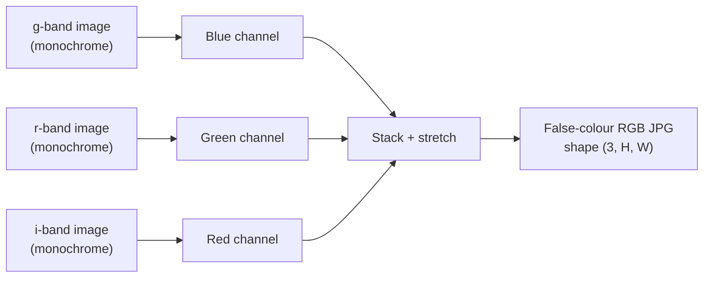

# 07 — Astronomical Photometry & Filters

> Telescopes don't take "colour photos" like your phone. They take a stack of black-and-white images, each through a different coloured glass, and *we* combine them into colour afterwards. Understanding this is the difference between treating our dataset as "just pictures" and understanding what each channel actually measures.

---

## Photometry: Measuring Brightness

**Photometry** is the measurement of the *amount* of light from an astronomical object. Since a calibrated CCD pixel is a linear count of photons (see [`06-how-telescopes-see.md`](06-how-telescopes-see.md)), measuring brightness is, at its core, adding up pixel values over the object.

Astronomers express brightness in **magnitudes**, an ancient, logarithmic, and famously backwards scale:

- **Smaller (or negative) magnitude = brighter.** The Sun is about −27; the faintest naked-eye stars are about +6.
- It's logarithmic: a difference of 5 magnitudes is a factor of exactly 100 in brightness.

You won't compute magnitudes in this project, but you'll see the word everywhere in the literature, so it's worth recognising. For our CNN, what matters is the underlying idea: **pixel value ≈ light received**, and that's a physical measurement we should treat with respect when we normalise it.

---

## Why Monochrome + Filters?

Recall the key fact from the previous page: **a CCD pixel just counts electrons; it has no idea what colour the photons were.** So how do we get colour?

By placing a **filter** — a piece of glass that transmits only a specific range of wavelengths — in front of the detector and taking a separate exposure for each one. Each exposure is a monochrome image of the sky *as seen in that wavelength band*.

This is actually **better** than your phone's single-shot colour:

- Phone sensors use a **Bayer filter** — a fixed mosaic of tiny red/green/blue filters glued over the pixels — sacrificing resolution and giving you whatever three broad bands the manufacturer chose.
- Astronomical filters are **swappable and precisely defined**. Scientists pick exactly which slices of the spectrum to measure, at full sensor resolution, calibrated to a physical standard.

The trade-off: you must take multiple exposures and combine them yourself.

---

## The SDSS `ugriz` Filter System

Our images come from the Sloan Digital Sky Survey, which uses a famous five-filter system: **`u`, `g`, `r`, `i`, `z`**. They tile the spectrum from the near-ultraviolet to the near-infrared:

| Filter | Name | Approx. central wavelength | Roughly what it captures |
|--------|------|----------------------------|--------------------------|
| `u` | ultraviolet | ~355 nm | Hot young stars, star formation. |
| `g` | green       | ~470 nm | Blue-green visible light. |
| `r` | red         | ~620 nm | Red visible light; well-matched to many galaxies. |
| `i` | near-infrared | ~750 nm | Cooler, older stars; light less affected by dust. |
| `z` | infrared    | ~890 nm | Even cooler stars, dusty regions, higher redshifts. |

Notice these run from short wavelengths (`u`, bluer) to long wavelengths (`z`, redder). Because different stellar populations emit at different wavelengths, **the ratio of brightness between filters tells you about a galaxy's physical nature** — exactly the "red and dead" elliptical vs "blue and star-forming" spiral distinction from [`05-galaxy-morphologies.md`](05-galaxy-morphologies.md).

> A galaxy's **colour** in astronomy is literally a *difference of magnitudes between two filters* (e.g. `g − r`). A large `g − r` means the galaxy is red; a small one means it's blue. Colour is a measurement, not a vibe.

---

## How Three Bands Become an RGB Image

The colourful galaxy JPGs in our dataset are **false-colour composites**. The standard recipe (popularised by Lupton et al. for SDSS) maps three filters to the three screen channels:

```
i-band  →  Red channel
r-band  →  Green channel
g-band  →  Blue channel
```

Each monochrome band is stretched (often with an arcsinh function, to show both bright cores and faint outskirts) and then stacked:



The result is an RGB image with shape `(3, H, W)` — which is, once more, exactly the [tensor](02-pytorch-tensors.md) shape PyTorch expects. When we load it in [`08-data-pipelines.md`](08-data-pipelines.md), channel 0 is roughly `i`, channel 1 roughly `r`, channel 2 roughly `g`.

> "False-colour" does **not** mean fake or misleading. It means the mapping from wavelength to screen-colour is a choice. The underlying measurements are real; we're just deciding how to show them to human eyes.

---

## Implications for Our CNN

- **The three channels are not redundant.** Unlike a phone photo (where R, G, B are heavily correlated), our channels encode genuinely different physics. A CNN can in principle learn colour-based features (e.g. "red + smooth → elliptical").
- **Normalisation per channel makes sense.** Because each band has its own brightness distribution, we'll often normalise each channel separately in the data pipeline.
- **Colour can be a shortcut — and a trap.** A model might learn "red = elliptical" and do well on average, but fail on a red, dusty, edge-on spiral. Watching for this is part of the Week-3 interpretation work.
- **Some information is lost in the JPG.** The original `ugriz` data has five bands and far more dynamic range than an 8-bit JPG. Our dataset is a compressed, human-friendly view. Real research pipelines often work with the raw FITS files instead.

---

## A Note on FITS (For the Curious)

Professional astronomers rarely work with JPGs. The native format is **FITS** (Flexible Image Transport System): a file that stores the raw floating-point pixel values *plus* a header full of metadata (sky coordinates, exposure time, filter, calibration constants). If you continue in astro-ML after this track, you'll meet FITS via the [`astropy`](https://www.astropy.org/) library. We use JPGs here because they're simpler to load in Colab; morphology labels come from the official GZ2 catalogues (CSV), not from folder names.

---

## Quick Self-Check

1. Why does an astronomical camera need a filter wheel instead of a single colour sensor?
2. In the SDSS `ugriz` system, which filter captures the bluest light? Which the reddest?
3. What does a galaxy's `g − r` colour tell you, physically?
4. Is "false colour" the same as "fake"? Explain.
5. What shape does the final RGB galaxy image have, and why is that convenient for PyTorch?

<details>
<summary>Answers</summary>

1. A CCD only counts photons without wavelength info. To get colour, you expose separately through different filters and combine the monochrome frames.
2. `u` is the bluest (near-UV, ~355 nm); `z` is the reddest (near-IR, ~890 nm).
3. It's a measure of colour: large `g − r` → red galaxy (older stars, little star formation); small `g − r` → blue galaxy (young stars, active star formation).
4. No. The measurements are real; "false colour" just means the wavelength-to-screen-channel mapping is a human choice, often using bands the eye can't even see.
5. `(3, H, W)` — three channels by height by width — which is exactly the channels-first layout PyTorch and `torchvision` expect.

</details>

---

## External Resources

- 📘 [SDSS — Camera and the `ugriz` filters](https://www.sdss.org/instruments/camera/) and [SDSS magnitudes & photometry](https://www.sdss.org/dr18/algorithms/magnitudes/).
- 📘 [Wikipedia — Photometric system](https://en.wikipedia.org/wiki/Photometric_system) and [Apparent magnitude](https://en.wikipedia.org/wiki/Apparent_magnitude).
- 📘 [Las Cumbres Observatory — Filters and colour in astronomy](https://lco.global/spacebook/light/).
- 📄 [Lupton et al. 2004 — Preparing Red-Green-Blue Images from CCD Data (arXiv)](https://arxiv.org/abs/astro-ph/0312483) — the actual paper behind SDSS colour images.
- 📺 [How astronomers make colour images — ESA/Hubble](https://esahubble.org/projects/fits_liberator/improc/).
- 📘 [Astropy — working with FITS files](https://docs.astropy.org/en/stable/io/fits/) — for when you graduate beyond JPGs.

---

⬅️ Previous: [`06-how-telescopes-see.md`](06-how-telescopes-see.md) | ➡️ Next: [`08-data-pipelines.md`](08-data-pipelines.md)
